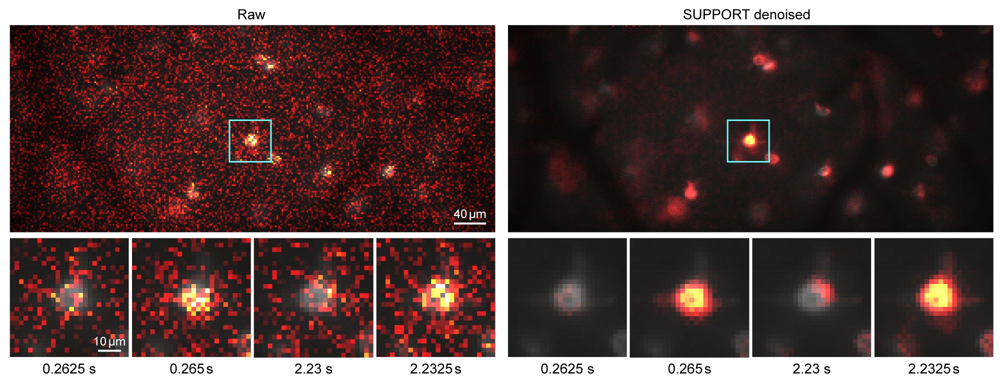
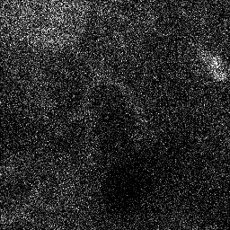
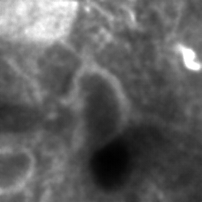

<h2><a href="https://github.com/NICALab/SUPPORT/blob/main/Beginner_guide.md"> 𝐅𝐨𝐫 𝐭𝐡𝐨𝐬𝐞 𝐰𝐡𝐨 𝐚𝐫𝐞 𝐧𝐞𝐰 𝐭𝐨 𝐏𝐲𝐭𝐡𝐨𝐧, 𝐩𝐥𝐞𝐚𝐬𝐞 𝐜𝐡𝐞𝐜𝐤 𝐭𝐡𝐞 𝐬𝐭𝐞𝐩-𝐛𝐲-𝐬𝐭𝐞𝐩 𝐢𝐧𝐬𝐭𝐫𝐮𝐜𝐭𝐢𝐨𝐧𝐬. 𝐂𝐥𝐢𝐜𝐤 𝐡𝐞𝐫𝐞.</a></h2>

#### We welcome discussions and collaborations! Try SUPPORT on your data, or contact us if you encounter any problems!
#### Not just voltage imaging data, SUPPORT can be used in any functional, volumetric, and timelapse data!
#### No additional data required, only noisy data itself is just used!

<p align="center">

</p>

<h3 align="center">SUPPORT, a self-supervised denoising method for voltage imaging data.</h3>

<p align="center">


</p>

<p align="center">
<a href="https://nicalab.github.io/SUPPORT/" target="_blank"><b>Project page</b></a> | 
<a href="https://www.nature.com/articles/s41592-023-02005-8" target="_blank"><b>Paper</b></a> | 
<a href="https://doi.org/10.5281/zenodo.8176722" target="_blank"><b>Data</b></a>
</p>


<p align="center">

</p>

## News
- [09/18/2023] Now **SUPPORT** has been published in **_Nature Methods_**! :smile:


## About SUPPORT

Here, we present SUPPORT (**S**tatistically **U**nbiased **P**rediction utilizing s**P**ati**O**tempo**R**al information in imaging da**T**a), **a self-supervised denoising method** for **voltage imaging data**. SUPPORT is based on the insight that a pixel value in voltage imaging data is highly dependent on its spatially neighboring pixels in the same time frame, even when its temporally adjacent frames do not provide useful information for statistical prediction. Such spatiotemporal dependency is captured and utilized to accurately denoise voltage imaging data in which the existence of the action potential in a time frame cannot be inferred by the information in other frames. We show, through simulations and experiments, that SUPPORT enables precise denoising of voltage imaging data while preserving the underlying dynamics in the scene.

We also demonstrate that SUPPORT can be used for denoising **time-lapse fluorescence microscopy images** of Caenorhabditis elegans (C. elegans), in which the imaging speed is not faster than the locomotion of the worm, as well as **static volumetric images** of Penicillium and mouse embryos. SUPPORT is exceptionally compelling for denoising voltage imaging and time-lapse imaging data and is even effective for denoising **calcium imaging data**.

For more details, please see the accompanying research publication titled "[Statistically Unbiased Prediction Enables Accurate Denoising of Voltage Imaging Data](https://www.nature.com/articles/s41592-023-02005-8)".

:raised_hands: If you encounter any trouble running the code or have any questions, do not hesitate to create an issue.

:revolving_hearts: We are ready to help you and look forward to making this tool widely used! Also, check the FAQ below to see if it answers your question!


## System Requirements

### Hardware Requirements

`test_GUI` is designed to run on a standard computer without requiring a large amount of RAM. If a GPU is available, the denoising process can be accelerated.

However, starting with the (Code) or running `train_GUI` requires a GPU with sufficient VRAM.

### Software Requirements

This is not requirements, but details of where we have tested on:

- Ubuntu 18.04
- Python 3.9
- Pytorch 1.13.0
- CUDA 11.7

## Installation

The installation time could vary depending on your network speed, but in general, it takes less than 20 minutes.

#### 1. Clone the repository
```
git clone https://github.com/NICALab/SUPPORT.git
```

#### 2. Navigate into the cloned folder
```
cd ./SUPPORT
```

#### 3. Create the conda environment
```
conda env create -f env.yml
```

(tip) If the conda stuck at `Solving environment: |`, try removing 

```
channels:
  - conda-forge
 ```
 
from env.yml and type `conda config --remove channels conda-forge`, and do this step.

#### 4. Activate the conda environment
```
conda activate SUPPORT
```

#### 5. Install Pytorch with **the version compatible with your OS and platform** from https://pytorch.org/get-started/locally/
```
conda install pytorch torchvision torchaudio pytorch-cuda=11.7 -c pytorch -c nvidia
```

## Getting Started (GUI)
**1. Denoise the data with pretrained networks**
```
python -m src.GUI.test_GUI
```
As the network is trained on different dataset of denoising,
for optimal performance, one might have to train the network.

For denoising data with a size of (128, 128, 1200), it took about 30 seconds with one RTX 2080 Ti GPU.

**2. Train the network**
```
python -m src.GUI.train_GUI
```
Choose the folder that contains training data, and then select the blind spot size. After training is done, you can browse the newly trained model and use it in train_GUI.

Representative frame is visualized and updated as training progresses.

Only supports training on GPU, and currently it requires more than 6.5GB of GPU memory.

## Getting Started (code)
**1. Train SUPPORT**
```
python -m src.train --exp_name mytest --noisy_data ./data/sample_data.tif --n_epochs 11 --checkpoint_interval 10
```
It will train a network using the sample data (For faster demo, the above code trains the network only for few iterations with small data).

For more options, please refer to the manual through the following code.
```
python -m src.train --help
```

**2. Inference with SUPPORT**

After training the network, the trained model will be saved on `results/saved_models/mytest/model_X.pth`, where X is the epoch of training.

```
python -m src.test
```

It will save the denoised file on `results/images/mytest/denoised_X.tif`.

<div align="center"></div>

Edit `src/test.py` file to change the path to infer with your data and models.


## Data availability
Dataset for Voltage imaging of paQuasAr6a, Voltron2, zArchon, SomArchon, volumetric structured imaging of mouse embryo and *penicillium*, and calcium imaging of larval zebrafish can be downloaded from [Zenodo](https://zenodo.org/record/8176722).

## Contributors
We are happy to help with any questions or requests.
Please contact to following authors to get in touch!
* Minho Eom (djaalsgh159@kaist.ac.kr)
* Seungjae Han (jay0118@kaist.ac.kr)

## Citation
Eom, M. et al. [Statistically unbiased prediction enables accurate denoising of voltage imaging data.](https://www.nature.com/articles/s41592-023-02005-8) *Nature Methods* (2023).
```
@article{eom2023statistically,
  title={Statistically unbiased prediction enables accurate denoising of voltage imaging data},
  author={Eom, Minho and Han, Seungjae and Park, Pojeong and Kim, Gyuri and Cho, Eun-Seo and Sim, Jueun and Lee, Kang-Han and Kim, Seonghoon and Tian, He and B{\"o}hm, Urs L and others},
  journal={Nature Methods},
  pages={1--12},
  year={2023},
  publisher={Nature Publishing Group US New York}
}
```

## FAQ
**- General**

**Q:** Which format your program/code accept?

**A:** Currently we accept tiff formats.

**- Running with code**

**Q:** Do I need to normalize the data for training and/or testing?

**A:** No you don't have to. Our code will do normalization automatically.

**Q:** Do I need to pad the data?

**A:** You don't have to. The output will have the same dimension as the input data in x and y dimensions. However, as we are using past and future *N* frames to obtain the denoised current frame, the first and final *N* frames of the final output are not obtained and discarded.

**Q:** Is it okay to train one model for several tiff stacks, and how can I do it?

**A:** Rather than training different models for "similar" recordings, we may train one SUPPORT model to process them once. There is a `is_folder` option to read all tiff stacks in the directory. For example, you may change like this. 
```
python -m src.train --exp_name mytest --noisy_data ./data/sample_data.tif
--> python -m src.train --exp_name mytest --noisy_data ./data/sample_dataset --is_folder
```


**- About GUI**

**Q:** I have a suggestion of UI/function/etc. for train/test GUI. or I found bugs/exceptions/errors. What should I do?

**A:** Make an issue so that we can handle it. If you are familiar with Pytorch and PyQt, a pull request would be fine!

## Star History

If you find our method useful or interesting, please give us star! 🌟

[](https://star-history.com/#NICALab/SUPPORT&Date)

